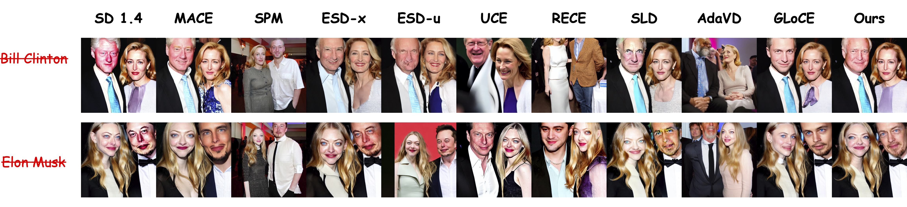

# [CVPR 2026] NLCE: Neighbor-Aware Localized Concept Erasure in Text-to-Image Diffusion Models
[](https://arxiv.org/abs/2603.25994)

### Authors: [Zhuan Shi*](https://www.linkedin.com/in/zhuan-shi/), [Alireza Dehghanpour Farashah*](https://www.linkedin.com/in/alirezafarashah/), [Rik de Vries](https://www.linkedin.com/in/rik-de-vries-ab204b185/), [Golnoosh Farnadi](https://gfarnadi.github.io)

<div align=center> 

</div>

<div align=center> 

</div>

## 📝 Abstract

Concept erasure in text-to-image diffusion models seeks to remove undesired concepts while preserving overall generative capability. Localized erasure methods aim to restrict edits to the spatial region occupied by the target concept. However, we observe that suppressing a concept can unintentionally weaken semantically related neighbor concepts, reducing fidelity in fine-grained domains. We propose Neighbor-Aware Localized Concept Erasure (NLCE), a training-free framework designed to better preserve neighboring concepts while removing target concepts. It operates in three stages: (1) a spectrally-weighted embedding modulation that attenuates target concept directions while stabilizing neighbor concept representations, (2) an attention-guided spatial gate that identifies regions exhibiting residual concept activation, and (3) a spatially-gated hard erasure that eliminates remaining traces only where necessary. This neighbor-aware pipeline enables localized concept removal while maintaining the surrounding concept neighborhood structure. Experiments on fine-grained datasets (Oxford Flowers, Stanford Dogs) show that our method effectively removes target concepts while better preserving closely related categories. Additional results on celebrity identity, explicit content and artistic style demonstrate robustness and generalization to broader erasure scenarios. Code is available at https://github.com/alirezafarashah/NLCE.git

## ⚙️ Method Overview
 
NLCE is a training-free, three-stage pipeline that removes target concepts while preserving semantically related neighbors:
 
1. **Stage 1 — Representation-Space Modulation:** Selectively suppresses target concept semantics in the token-level representation space while reinforcing neighboring concepts via a spectrally-weighted projection operator.
2. **Stage 2 — Attention-Guided Spatial Gating:** Uses a dry forward pass to extract attention maps and construct a spatial gate that identifies pixels where residual target influence persists. A second pass then suppresses cross-attention for the target concept precisely within these gated regions, preserving unaffected areas.
3. **Stage 3 — Gated Feature Clean-up:** Eliminates remaining residual target signals using a spatially-gated hard erasure, securely zeroing out traces within the targeted region boundaries without affecting untouched areas.
 

# Setup

## Install Dependencies

1. (Optional) Creating conda environment

```bash
conda create -n nlce python=3.10
conda activate nlce
```

2. Build from source / Install required packages

```bash
pip install -r requirements.txt
```

# Usage

## 🚀 Running NLCE

### Dog and Flower Concept Erasure

```bash
python object_erasure.py \
  --prompt_file data/demo.csv \
  --alpha 1.0 \
  --beta 1.0 \
  --demo_mode
```

> **Note:** When `demo_mode` is enabled, the system bypasses the neighbor-retrieval procedure and instead loads the predefined neighbor sets stored in `multi_neighbors.json`. This mode is to be used when the index file is not available (see **Notes** section).

### Celebrity Concept Erasure

```bash
python celebrity_erasure.py \
  --output_dir results_celebrity/outputs\
  --prompt_files celeb_configs \
  --alpha 1.0 \
  --beta 0.9
```

> **Note:** Make sure all config `.csv` files are inside one folder (`erasure_configs/`, `celeb_configs/`, etc.)

### I2P Dataset Concept Erasure

We provide a separate script, `I2P_generation.py`, to run NLCE-style concept erasure on the **I2P** dataset. This script is designed to work with a minimal interface – **do not pass any additional arguments beyond the ones shown below.**

```bash
python I2P_generation.py \
  --erasure_beta 1.0 \
  --preserve_gamma 0.5 \
  --thr 14
```

### Artist Erasure

```bash
python artist_erasure.py \
  --prompt_file data/big_artist_prompts.csv \
  --alpha 1.0 \
  --beta 1.0 \
```

# Project Info

## 📁 Project Structure

```
NLCE/
├── object_erasure.py                # Dog/Flower pipeline
├── celebrity_erasure.py             # Celebrity-focused pipeline
├── evaluation/                      
│   ├── artist/
│   │   └──...                       # Files used for artist evaluation 
│   └── ...
├── data/                            # Config CSVs for all categories
│   ├── config_flowers_camellia.csv
│   └── ...
└── other/
    └── neighborhood_set_file_constructor/
        └── neighborhood_set_file_constructor.ipynb 
```


## 📌 Notes

- The embedding index `dual_embedding_index_with_scores.pt` (~19GB) is too large to be hosted directly on GitHub. You can download it via [Google Drive](<https://drive.google.com/file/d/1aVhBl-6dGF7zHQ-eGjMhHT4rg4z2yRwP/view?usp=share_link>). 
- A set of generated concept neighborhoods is given in `multi_neighbors.json` that can be used to generate images of Oxford Flowers.

# Acknowledgments
We thank the following contributors that our code is based on: [GLoCE](https://github.com/Hyun1A/GLoCE).

# Reference
Please cite our paper if you use our method in your works:

```bibtex
@misc{shi2026neighborawarelocalizedconcepterasure,
      title={Neighbor-Aware Localized Concept Erasure in Text-to-Image Diffusion Models}, 
      author={Zhuan Shi and Alireza Dehghanpour Farashah and Rik de Vries and Golnoosh Farnadi},
      year={2026},
      eprint={2603.25994},
      archivePrefix={arXiv},
      primaryClass={cs.CV},
      url={https://arxiv.org/abs/2603.25994}, 
}
```
